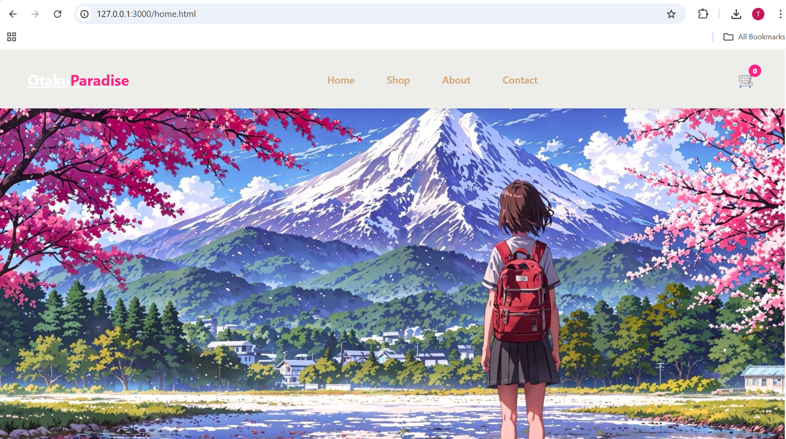
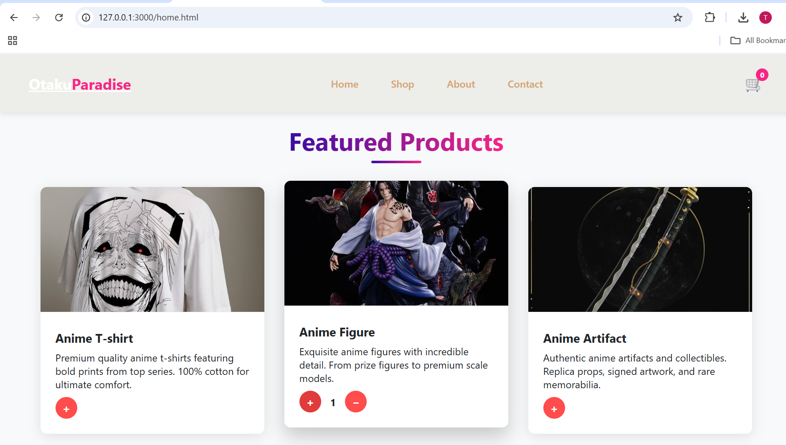
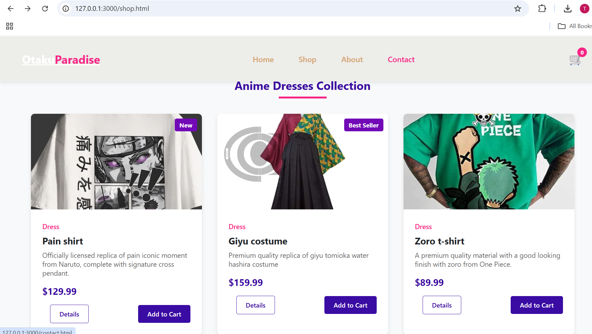

# OtakuParadise


A vibrant and visually engaging web application for fashion enthusiasts, featuring a stylish UI and interactive product displays.


---


##  Table of Contents

- [Demo](#demo)

- [Features](#features)

- [Tech Stack](#tech-stack)

- [Project Structure](#project-structure)

- [Setup \& Usage](#setup--usage)

- [Screenshots](#screenshots)

- [Future Plans](#future-plans)

- [Contributing](#contributing)

- [License](#license)


---


##  Screenshots

### Home Page






### Shop Page




### Contact Page


---


##  Features

- Stylish, responsive UI using HTML, CSS (custom styles like `home.css`, `shop.css`, etc.)

- Dynamic navigation between pages like Home, About, Contact, and Shop

- Image galleries for product display

- Interactive elements using custom JavaScript files (`home.js`, `about.js`, `contact.js`, `shop.js`)


---


##  Tech Stack

- **Frontend:** HTML5, CSS3, JavaScript  

- **Design:** Custom styles stored in `\*.css` files for layout and themes  

- **Interactivity:** JavaScript for click handlers and transitions  

- **Assets:** Embedded images in each page folder


---


##  Project Structure

OtakuParadise/

├── home.html, home.css, home.js

├── about.html, about.css, about.js

├── contact.html, contact.css, contact.js

├── shop.html, shop.css, shop.js

├── dress1.jpeg, dress2.jpeg, etc. (product images)

└── README.md


---


##  Setup \& Usage


To view the project:

1. Clone the repository:  

&nbsp;  ```bash

&nbsp;  git clone https://github.com/tridha21/OtakuParadise.git


